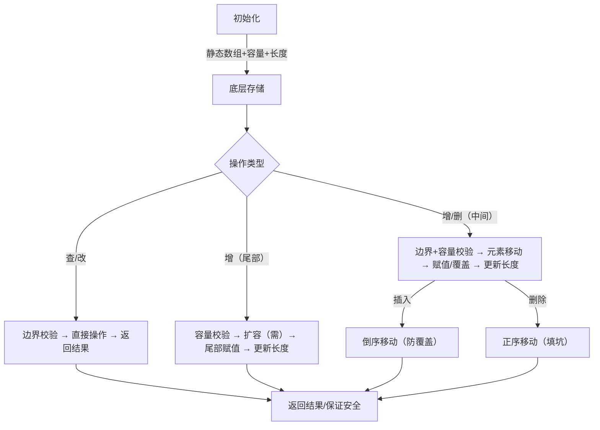

# 2.2迭代与递归
## 2.2.1迭代
1. for循环
适合在预先知道迭代次数时使用
```python
# 1到n求和
def for_loop(n):
	res = 0
	for i in range(1,n+1):
		res += i
	return res
```
2. while循环
每轮先检查条件，确定为真再继续执行循环，否则结束
条件每轮可以进行多次更新，更灵活
```python
def while_loop(n):
	res = 0
	i = 1 # 初始化变量
	# 循环求和1到n
	while i <=n:
		res += i
		i +=1
	return res	
	
def while_loop_ii(n: int) -> int:
    """while 循环（两次更新）"""
    res = 0
    i = 1  # 初始化条件变量
    # 循环求和 1, 4, 10, ...
    while i <= n:
        res += i
        # 更新条件变量
        i += 1
        i *= 2
    return res	
```
## 2.2.2递归
函数调用自身来解决问题，直到触发终止条件。
解决分治相关更好用。（map，reduce？）
```python
def recur(n):
	# 终止条件
	if n == 1:
		return 1
	# 递	
	res = recur(n - 1)
	# 归
	return n + res
```
使用递归解决斐波那契数列
```python
def fib(n: int) -> int:
    """斐波那契数列：递归"""
    # 终止条件 f(1) = 0, f(2) = 1
    if n == 1 or n == 2:
        return n - 1
    # 递归调用 f(n) = f(n-1) + f(n-2)
    res = fib(n - 1) + fib(n - 2)
    # 返回结果 f(n)
    return res
```
显式栈模拟调用栈行为
```python
def for_loop_recur(n: int) -> int:
    """使用迭代模拟递归"""
    # 使用一个显式的栈来模拟系统调用栈
    stack = []
    res = 0
    # 递：递归调用
    for i in range(n, 0, -1):
        # 通过“入栈操作”模拟“递”
        stack.append(i)
    # 归：返回结果
    while stack:
        # 通过“出栈操作”模拟“归”
        res += stack.pop()
    # res = 1+2+3+...+n
    return res

stack = [] # stack 是一个列表对象 
stack.append(i) # append 是 stack 这个列表对象的方法，必须通过 stack 调用 
stack.pop() # pop 也是 stack 的方法，同理
```
- 在 Python 中，方法其实是「绑定到对象的函数」—— 列表的 `append` 方法本质上也是一段函数逻辑，但它被 “封装” 在列表类（`list`）中，专门用来操作列表对象的内部数据（比如给列表加元素、删元素）。
- 函数是通用的操作功能，方法是封装在类里的功能，自定义类和自定义函数是满足具体开发需要的功能，依据适用范围可以选择
# 2.3时间复杂度
加法 1ns，乘法10ns，打印5ns
$$O(1)<O(logn)<O(n)<O(nlogn)<O(n^2)<O(2^n)<O(n!)$$
冒泡排序，算法复杂度$n^2$
```python
def bubble_sort(nums: list[int]) -> int:
    """平方阶（冒泡排序）"""
    count = 0  # 计数器
    # 外循环：未排序区间为 [0, i]
    for i in range(len(nums) - 1, 0, -1):
        # 内循环：将未排序区间 [0, i] 中的最大元素交换至该区间的最右端
        for j in range(i):
            if nums[j] > nums[j + 1]:
                # 交换 nums[j] 与 nums[j + 1]
                tmp: int = nums[j]
                nums[j] = nums[j + 1]
                nums[j + 1] = tmp
                count += 3  # 元素交换包含 3 个单元操作
    return count
```
线性查找，复杂度取决于元素所在位置
```python
def random_numbers(n: int) -> list[int]:
    """生成一个数组，元素为: 1, 2, ..., n ，顺序被打乱"""
    # 生成数组 nums =: 1, 2, 3, ..., n
    nums = [i for i in range(1, n + 1)]
    # 随机打乱数组元素
    random.shuffle(nums)
    return nums

def find_one(nums: list[int]) -> int:
    """查找数组 nums 中数字 1 所在索引"""
    for i in range(len(nums)):
        # 当元素 1 在数组头部时，达到最佳时间复杂度 O(1)
        # 当元素 1 在数组尾部时，达到最差时间复杂度 O(n)
        if nums[i] == 1:
            return i
    return -1
```
# 2.4空间复杂度
通常统计暂存数据、栈帧空间和输出数据三部分
通常只关注最差空间复杂度
$$O(1)<O(log n)<O(n)<O(n^2)<O(2^n)$$
```python
def function() -> int:
    # 执行某些操作
    return 0

def loop(n: int):
    """循环的空间复杂度为 O(1)"""
    for _ in range(n):
        function()

def recur(n: int):
    """递归的空间复杂度为 O(n)"""
    if n == 1:
        return
    return recur(n - 1)
```
# 3.3数据结构
数据结构可以从逻辑结构和物理结构两个角度进行分类。逻辑结构描述了数据元素之间的逻辑关系，而物理结构描述了数据在计算机内存中的存储方式。
常见的逻辑结构包括线性、树状和网状等。通常我们根据逻辑结构将数据结构分为线性（数组、链表、栈、队列）和非线性（树、图、堆）两种。哈希表的实现可能同时包含线性数据结构和非线性数据结构。
当程序运行时，数据被存储在计算机内存中。每个内存空间都拥有对应的内存地址，程序通过这些内存地址访问数据。
物理结构主要分为连续空间存储（数组）和分散空间存储（链表）。所有数据结构都是由数组、链表或两者的组合实现的。
# 4.1数组
## 元素操作
```python
#访问元素
def random_access(nums: list[int]) -> int:
    """随机访问元素"""
    # 在区间 [0, len(nums)-1] 中随机抽取一个数字
    random_index = random.randint(0, len(nums) - 1)
    # 获取并返回随机元素
    random_num = nums[random_index]
    return random_num

#插入元素，插入倒序，向后移动留出空位
 def insert(nums: list[int], num: int, index: int):
    """在数组的索引 index 处插入元素 num"""
    # 把索引 index 以及之后的所有元素向后移动一位
    for i in range(len(nums) - 1, index, -1):
        nums[i] = nums[i - 1]
    # 将 num 赋给 index 处的元素
    nums[index] = num

# 删除元素，删除正序，后边的元素依次补位
def remove(nums: list[int], index: int):
    """删除索引 index 处的元素"""
    # 把索引 index 之后的所有元素向前移动一位
    for i in range(index, len(nums) - 1):
        nums[i] = nums[i + 1]      
   
#遍历数组
 def traverse(nums: list[int]):
    """遍历数组"""
    count = 0
    # 通过索引遍历数组
    for i in range(len(nums)):
        count += nums[i]
    # 直接遍历数组元素
    for num in nums:
        count += num
    # 同时遍历数据索引和元素
    for i, num in enumerate(nums):
        count += nums[i]
        count += num

#查找数组
def find(nums: list[int], target: int) -> int:
    """在数组中查找指定元素"""
    for i in range(len(nums)):
        if nums[i] == target:
            return i
    return -1

#扩容数组
 def extend(nums: list[int], enlarge: int) -> list[int]:
    """扩展数组长度"""
    # 初始化一个扩展长度后的数组
    res = [0] * (len(nums) + enlarge)
    # 将原数组中的所有元素复制到新数组
    for i in range(len(nums)):
        res[i] = nums[i]
    # 返回扩展后的新数组
    return res 
```
# 4.2链表
链表（linked list）是一种线性数据结构，其中的每个元素都是一个节点对象，各个节点通过“引用”相连接。引用记录了下一个节点的内存地址，通过它可以从当前节点访问到下一个节点。
链表的设计使得各个节点可以分散存储在内存各处，它们的内存地址无须连续。
### 初始化链表
```python
# 初始化链表 1 -> 3 -> 2 -> 5 -> 4
# 初始化各个节点
n0 = ListNode(1)
n1 = ListNode(3)
n2 = ListNode(2)
n3 = ListNode(5)
n4 = ListNode(4)
# 构建节点之间的引用
n0.next = n1
n1.next = n2
n2.next = n3
n3.next = n4
```
### 插入节点
只需改变两个节点引用（指针）即可，时间复杂度为$O(1)$ 。
「暂存原后继节点 → 连接新节点的后继 → 连接原节点的后继」
```python
def insert(n0: ListNode, P: ListNode):
    """在链表的节点 n0 之后插入节点 P"""
    n1 = n0.next
    P.next = n1
    n0.next = P
```
### 删除节点
只需改变一个节点引用（指针）即可
```python
def remove(n0: ListNode):
    """删除链表的节点 n0 之后的首个节点"""
    if not n0.next:
        return
    # n0 -> P -> n1
    P = n0.next
    n1 = P.next
    n0.next = n1
```
### 访问节点
线性查找。程序需要从头节点出发，逐个向后遍历，直至找到目标节点。
也就是说，访问链表的第 i 个节点需要循环 i−1 轮，时间复杂度为 $O(n)$。
```python
def access(head: ListNode, index: int) -> ListNode | None:
    """访问链表中索引为 index 的节点"""
    for _ in range(index):
        if not head:
            return None
        head = head.next
    return head
```
查找节点
```python
def find(head: ListNode, target: int) -> int:
    """在链表中查找值为 target 的首个节点"""
    index = 0
    while head:
        if head.val == target:
            return index
        head = head.next
        index += 1
    return -1
```
- **for 循环**：适合「知道要循环多少次」的场景（比如访问指定索引），核心是 “按次数执行”；
- **while 循环**：适合「不知道循环次数，满足条件就停」的场景（比如查找指定值），核心是 “按条件执行”；
- 链表中：
    - 访问指定索引 → 固定步数 → 用 `for`；
    - 查找指定值 → 未知步数 → 用 `while`。
# 4.3列表
## 4.3.1列表常用操作
初始化列表
```python
# 初始化列表
# 无初始值
nums1: list[int] = []
# 有初始值
nums: list[int] = [1, 3, 2, 5, 4]
```
- 数组 / 列表（Python `list`）：靠「索引 + 连续内存」组织数据，查得快、改中间慢；
- 链表（自定义类）：靠「引用 + 非连续内存」组织数据，查得慢、改中间快
**插入与删除元素**
```python
# 清空列表
nums.clear()

# 在尾部添加元素
nums.append(1)
nums.append(3)
nums.append(2)
nums.append(5)
nums.append(4)

# 在中间插入元素
nums.insert(3, 6)  # 在索引 3 处插入数字 6

# 删除元素
nums.pop(3)        # 删除索引 3 处的元素
```
**遍历列表**
```python
# 通过索引遍历列表
count = 0
for i in range(len(nums)):
    count += nums[i]

# 直接遍历列表元素
for num in nums:
    count += num
```
**排序列表**
```python
# 排序列表
nums.sort()  # 排序后，列表元素从小到大排列
```
- 方式适用场景典型用法
`list.sort()`不需要保留原列表，只想修改当前列表
`sorted()`需要保留原列表，或对非列表对象排序（如元组）`new_nums = sorted(nums)`
## 4.3.2列表实现
尝试实现一个简易版列表，包括以下三个重点设计。

- 初始容量：选取一个合理的数组初始容量。在本示例中，我们选择 10 作为初始容量。
- 数量记录：声明一个变量 size ，用于记录列表当前元素数量，并随着元素插入和删除实时更新。根据此变量，我们可以定位列表尾部，以及判断是否需要扩容。
- 扩容机制：若插入元素时列表容量已满，则需要进行扩容。先根据扩容倍数创建一个更大的数组，再将当前数组的所有元素依次移动至新数组。在本示例中，我们规定每次将数组扩容至之前的 2 倍。

- **插入：从后往前挪，先挪后面的，不丢数据**；
- **删除：从前往后挪，先挪前面的，填坑彻底**。
```python
class MyList:
    """列表类"""

    def __init__(self):
        """构造方法"""
        self._capacity: int = 10  # 列表容量
        self._arr: list[int] = [0] * self._capacity  # 数组（存储列表元素）
        self._size: int = 0  # 列表长度（当前元素数量）
        self._extend_ratio: int = 2  # 每次列表扩容的倍数

    def size(self) -> int:
        """获取列表长度（当前元素数量）"""
        return self._size

    def capacity(self) -> int:
        """获取列表容量"""
        return self._capacity

    def get(self, index: int) -> int:
        """访问元素"""
        # 索引如果越界，则抛出异常，下同
        if index < 0 or index >= self._size:
            raise IndexError("索引越界")
        return self._arr[index]

    def set(self, num: int, index: int):
        """更新元素"""
        if index < 0 or index >= self._size:
            raise IndexError("索引越界")
        self._arr[index] = num

    def add(self, num: int):
        """在尾部添加元素"""
        # 元素数量超出容量时，触发扩容机制
        if self.size() == self.capacity():
            self.extend_capacity()
        self._arr[self._size] = num
        self._size += 1

    def insert(self, num: int, index: int):
        """在中间插入元素"""
        if index < 0 or index >= self._size:
            raise IndexError("索引越界")
        # 元素数量超出容量时，触发扩容机制
        if self._size == self.capacity():
            self.extend_capacity()
        # 将索引 index 以及之后的元素都向后移动一位
        for j in range(self._size - 1, index - 1, -1):
            self._arr[j + 1] = self._arr[j]
        self._arr[index] = num
        # 更新元素数量
        self._size += 1
		# 减 1 是为了适配 “索引从 0 开始” 和 “range 左闭右开” 的规则
	
    def remove(self, index: int) -> int:
        """删除元素"""
        if index < 0 or index >= self._size:
            raise IndexError("索引越界")
        num = self._arr[index]
        # 将索引 index 之后的元素都向前移动一位
        for j in range(index, self._size - 1):
            self._arr[j] = self._arr[j + 1]
        # 更新元素数量
        self._size -= 1
        # 返回被删除的元素
        return num

    def extend_capacity(self):
        """列表扩容"""
        # 新建一个长度为原数组 _extend_ratio 倍的新数组，并将原数组复制到新数组
        self._arr = self._arr + [0] * self.capacity() * (self._extend_ratio - 1)
        # 更新列表容量
        self._capacity = len(self._arr)

    def to_array(self) -> list[int]:
        """返回有效长度的列表"""
        return self._arr[: self._size]
# 列表切片语法：从 `self._arr` 的第 0 个元素开始，截取到 `self._size` 位置（不包含该位置）的所有元素。
```

### 总结

1. `get(self, index)` 定义时，`self` 是必须的第一个参数，代表 “实例本身”；
2. 调用时**只需要传入 `index`**，`self` 由 Python 自动传入；
3. `self` 的核心作用：让方法能访问到当前实例的属性（比如 `self._arr`、`self._size`）；
4. 这个规则适用于所有 Python 类的实例方法（除了静态方法 / 类方法）。

简单记：`self` 是 “自带的参数”，调用方法时只需要传 “自定义的参数”（比如 `index`）

- 带 `()` → 是调用方法（比如 `self.size()`、`self.add(1)`）；
- 不带 `()` → 是访问属性（比如 `self._arr`、`self._size`）；
- 访问属性后加 `[index]` → 是操作列表的索引位置（比如 `self._arr[0]`）。

### 总结

1. **双下划线首尾（`__xxx__`）**：魔法方法，Python 内置，自动触发；
2. **单下划线开头（`_xxx`）**：约定私有，内部实现，提醒使用者不要直接访问；
3. **无下划线（`xxx`）**：公开接口，对外提供功能，安全调用；
4. **核心原则**：封装内部细节（单下划线），暴露简单接口（无下划线），利用魔法方法适配 Python 原生语法（双下划线首尾）。
- 无下划线`insert()`、`find()`公开方法 / 属性（对外暴露的接口），使用者可以直接调用（比如 `my_list.insert(1,2)`）
- 单下划线开头`_arr`、`_size`私有属性 / 方法（约定俗成），告诉使用者 “这是内部实现，不要直接访问”
- 双下划线开头 + 结尾`__init__`、`__len__`魔法方法（Python 内置），有特殊含义，会被 Python 解释器自动调用
### 切片语法的完整逻辑

切片的通用格式是 `arr[起始索引:结束索引:步长]`，而 `arr[:self._size]` 是省略了「起始索引」和「步长」的简写：

- 省略起始索引 → 默认从 `0` 开始；
- 省略步长 → 默认步长为 `1`（逐个截取）；
- 结束索引是 `self._size` → 截取到索引 `self._size - 1` 为止（正好是最后一个有效元素）。



# 4.5小结
1.   重点回顾
- 数组和链表是两种基本的数据结构，分别代表数据在计算机内存中的两种存储方式：连续空间存储和分散空间存储。两者的特点呈现出互补的特性。
- 数组支持随机访问、占用内存较少；但插入和删除元素效率低，且初始化后长度不可变。
- 链表通过更改引用（指针）实现高效的节点插入与删除，且可以灵活调整长度；但节点访问效率低、占用内存较多。常见的链表类型包括单向链表、环形链表、双向链表。
- 列表是一种支持增删查改的元素有序集合，通常基于动态数组实现。它保留了数组的优势，同时可以灵活调整长度。
- 列表的出现大幅提高了数组的实用性，但可能导致部分内存空间浪费。
- 程序运行时，数据主要存储在内存中。数组可提供更高的内存空间效率，而链表则在内存使用上更加灵活。
- 缓存通过缓存行、预取机制以及空间局部性和时间局部性等数据加载机制，为 CPU 提供快速数据访问，显著提升程序的执行效率。
- 由于数组具有更高的缓存命中率，因此它通常比链表更高效。在选择数据结构时，应根据具体需求和场景做出恰当选择。

```python
class MyList: 
# 1. 初始化（_capacity/_size/_arr） 
def __init__(self): 
	pass 
# 自己写 
# 2. 尾部添加元素（add） 
def add(self, num): 
	pass # 自己写（要考虑扩容逻辑） 
# 3. 中间插入元素（insert） 
def insert(self, index, num): 
	pass # 自己写（倒序移动元素） 
# 4. 删除指定索引元素（remove） 
def remove(self, index): 
	pass # 自己写（正序移动元素） 
# 5. 获取指定索引元素（get） 
def get(self, index): 
	pass # 自己写（边界检查） 
# 6. 返回有效元素列表（to_array） 
def to_array(self): 
	pass # 自己写（切片）
```
步骤核心操作必须注意的细节
1. 定义类共享属性`__init__` 里初始化 `self._capacity`/`self._arr`/`self._size`/`self._extend_ratio`
✅ 下划线：`_xxx` 是约定私有（外部不建议改），`__xxx__` 是魔法方法，`__xxx` 是强制私有；
✅ `self._arr = [0]*self._capacity` 是创建固定长度的底层数组（不是函数）。
2. 封装查询方法写 `size(self)`/`capacity(self)` 只返回属性值
✅ 无参数：`self` 自动传入，调用时直接 `实例.size()`；
✅ 只读不改：只返回值，不修改属性，保证数据安全。
3. 尾部添加（add）检查扩容 → 赋值 `self._arr[self._size] = num` → `self._size +=1`
✅ 扩容时机：必须在赋值前检查（`self.size()==self.capacity()`），避免索引越界；
✅ 赋值位置：`self._size` 是尾部空位的索引（有效元素数 = 空位索引）。
4. 中间插入（insert）越界检查 → 扩容 → 倒序移动元素 → 赋值 → `self._size +=1`
✅ 越界警告：`index<0`/`index>=self._size` 抛 `IndexError`；
✅ 移动方向：从后往前（`range(self._size-1, index-1, -1)`），避免覆盖未移动的元素；
✅ 减 1 原因：适配索引从 0 开始 +`range`左闭右开规则。
5. 删除元素（remove）越界检查 → 正序移动元素填坑 → `self._size -=1`
✅ 移动方向：从前往后（`range(index, self._size-1)`），把后面的元素往前挪，补上删除的空位；
✅ 不用扩容：删除只减`_size`，底层数组容量不变。
6. 查 / 改元素（get/set）get：越界检查 → 返回 `self._arr[index]`；
set：越界检查 → 赋值 `self._arr[index]=num`
✅ 越界必查：所有操作索引的方法都要加越界警告，避免程序崩溃；
✅ return 规则：get 需要 return 值，set 只修改不用 return。
7. 扩容（extend_capacity）新容量 = 原容量 × 扩容倍数 → 新建数组 → 复制旧元素 → 更新`self._arr`/`self._capacity`
✅ 扩容倍数：用 `self._extend_ratio` 统一规则（比如 2 倍），避免硬编码；
✅ 数据迁移：必须把旧数组的有效元素复制到新数组，不能丢数据。